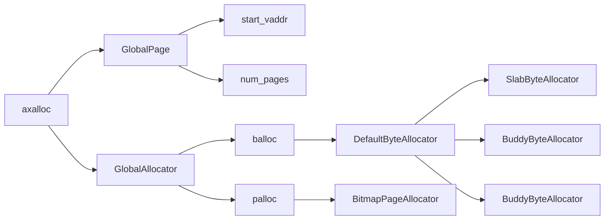

```mermaid
graph LR;
    Z[axalloc] --> A
    Z --> Y[GlobalPage]
    Y --> X[start_vaddr]
    Y --> W[num_pages]
    A[GlobalAllocator] --> B[balloc];
    A --> C[palloc]
    B --> D[DefaultByteAllocator]
    D --> F[SlabByteAllocator]
    D --> G[BuddyByteAllocator]
    D --> H[BuddyByteAllocator]
    C --> E[BitmapPageAllocator]

```