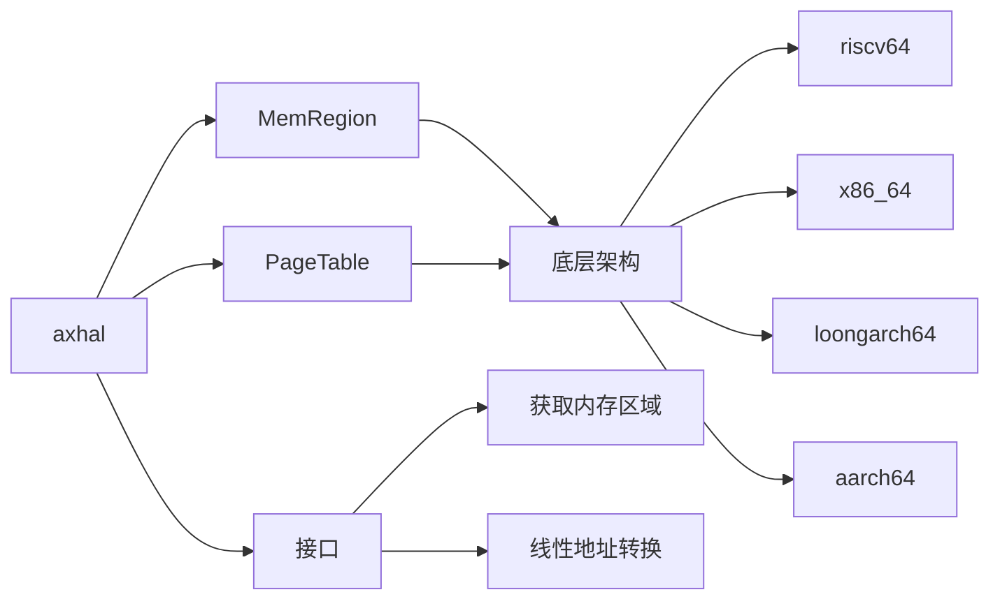

```mermaid
graph LR;
    A[axhal] --> B[MemRegion]
    A --> C[PageTable]
B --> D[底层架构]
C --> D
D --> E[riscv64]
D --> F[x86_64]
D --> G[loongarch64]
D --> H[aarch64]
A --> I[接口]
I --> J[获取内存区域]
I --> K[线性地址转换]
```