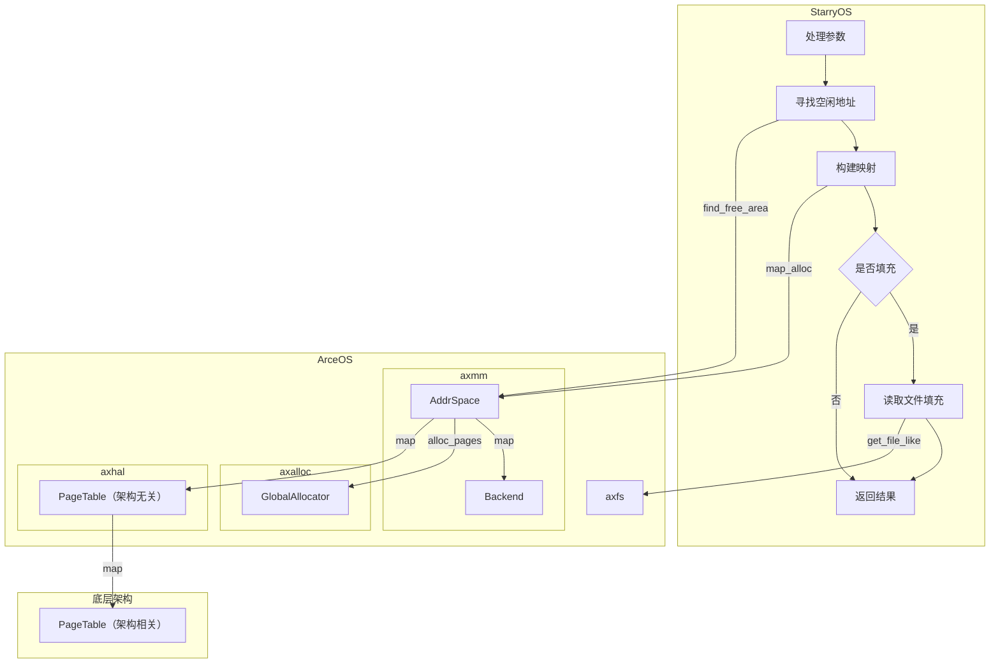

```mermaid
graph TD;
    subgraph StarryOS
        A[处理参数]
        B[寻找空闲地址]
        C[构建映射]
        D@{shape: diamond, label: "是否填充"}
        E[读取文件填充]
        F[返回结果]
        A --> B
        B --> C
        C --> D
        D -->|是| E
        D -->|否| F
        E --> F
    end
    subgraph ArceOS
        subgraph axmm
            G[AddrSpace]
            H[Backend]
            G -->|map| H
        end
        subgraph axalloc
            I[GlobalAllocator]
        end
        G -->|alloc_pages| I
        subgraph axhal
            J[PageTable（架构无关）]
        end
        G -->|map| J
        L[axfs]
        E -->|get_file_like| L
    end
    subgraph 底层架构
        K[PageTable（架构相关）]
    end
    B -->|find_free_area| G
    C -->|map_alloc| G
    J -->|map| K

```