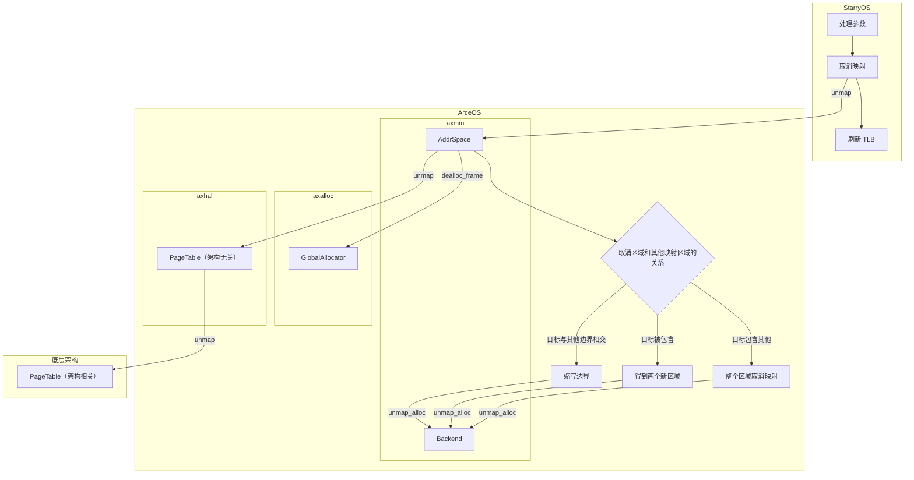

```mermaid
graph TD;
    subgraph StarryOS
        A[处理参数]
        B[取消映射]
        C[刷新 TLB]
        A --> B
        B --> C
    end
    subgraph ArceOS
        D@{shape: diamond, label: "取消区域和其他映射区域的关系"}
        E[整个区域取消映射]
        F[得到两个新区域]
        N[缩写边界]
        subgraph axmm
            G[AddrSpace]
            H[Backend]
        end
        G --> D
        D -->|目标包含其他| E
        D -->|目标被包含| F
        D -->|目标与其他边界相交| N
        E -->|unmap_alloc| H
        F -->|unmap_alloc| H
        N -->|unmap_alloc| H
        subgraph axalloc
            I[GlobalAllocator]
        end
        G -->|dealloc_frame| I
        subgraph axhal
            J[PageTable（架构无关）]
        end
        G -->|unmap| J
    end
    B -->|unmap| G
    subgraph 底层架构
        K[PageTable（架构相关）]
    end
    J -->|unmap| K

```