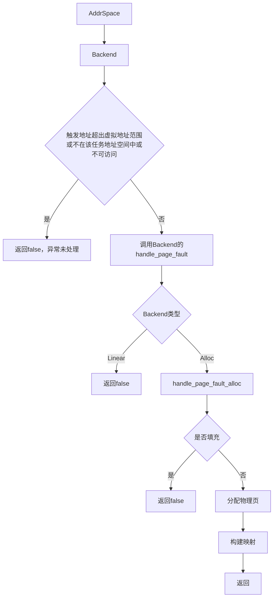

```mermaid
graph TD;
    A[AddrSpace] --> B[Backend];
    B --> D{触发地址超出虚拟地址范围或不在该任务地址空间中或不可访问};
    D -- 是 --> E[返回false，异常未处理];
    D -- 否 --> F[调用Backend的handle_page_fault];
    F --> H{Backend类型};
    H -- Linear --> I[返回false];
    H -- Alloc --> J[handle_page_fault_alloc];
    J --> K{是否填充};
    K -- 是 --> L[返回false]
    K -- 否 --> M[分配物理页]
    M --> N[构建映射]
    N --> O[返回]
```