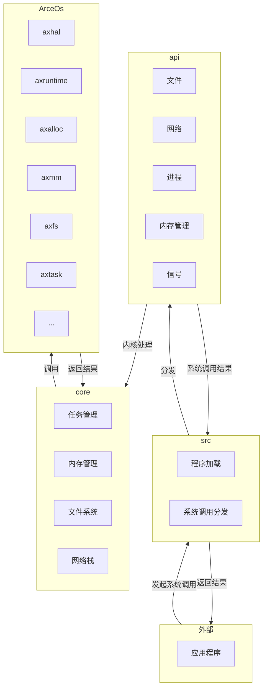

```mermaid
graph TD;
    subgraph 外部
        A[应用程序]
    end
    subgraph src
        B[程序加载]
        C[系统调用分发]
    end
    subgraph api
        D[文件]
        E[网络]
        F[进程]
        G[内存管理]
        H[信号]
    end
    subgraph core
        I[任务管理]
        J[内存管理]
        K[文件系统]
        L[网络栈]
    end
    subgraph ArceOs
        M[axhal]
        N[axruntime]
        O[axalloc]
        P[axmm]
        Q[axfs]
        R[axtask]
        S[...]
    end
    外部 -->|发起系统调用| src;
    src -->|返回结果| 外部;
    src -->|分发| api;
    api -->|系统调用结果| src;
    api -->|内核处理| core;

    core -->|调用| ArceOs;
    ArceOs -->|返回结果| core;
```